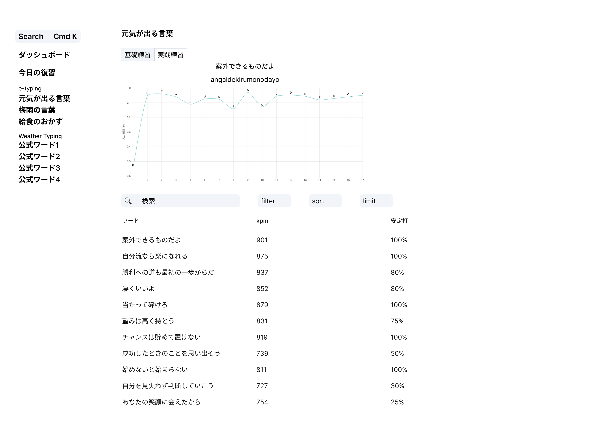
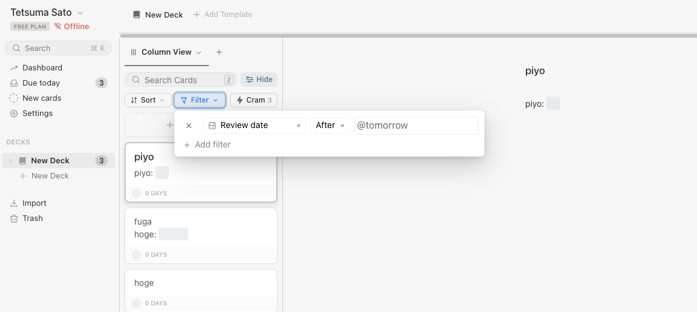
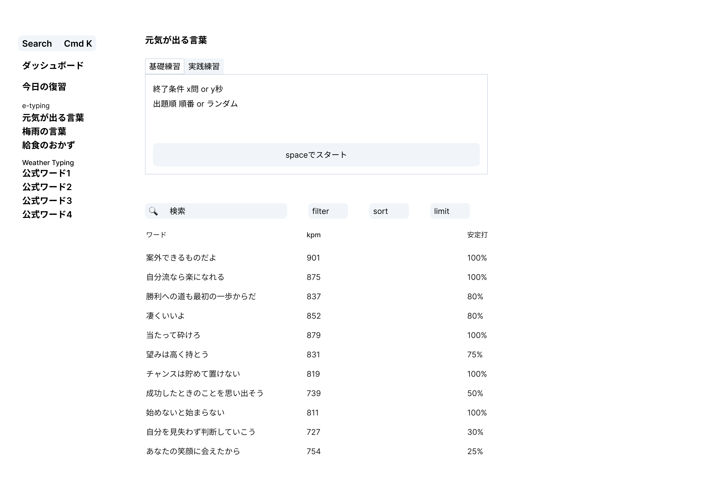
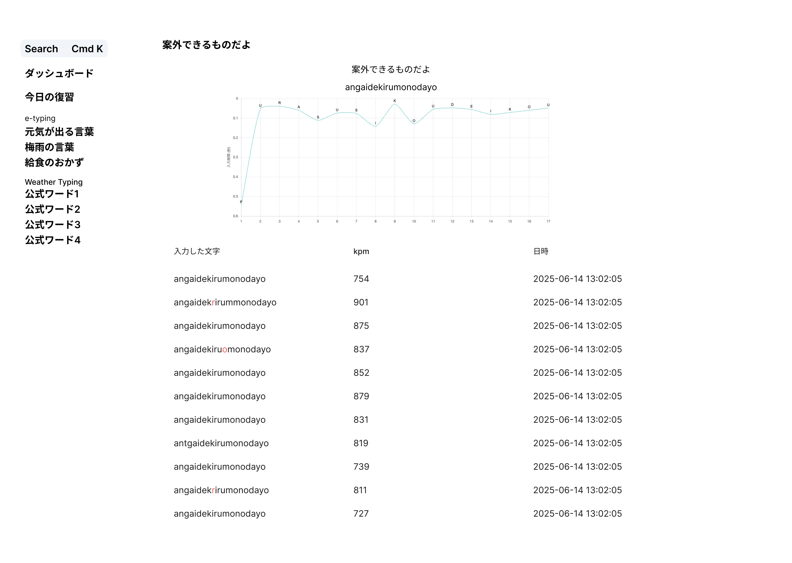
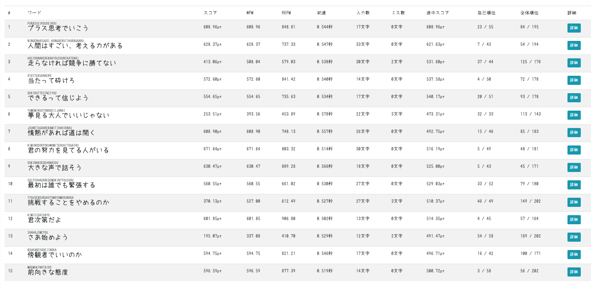
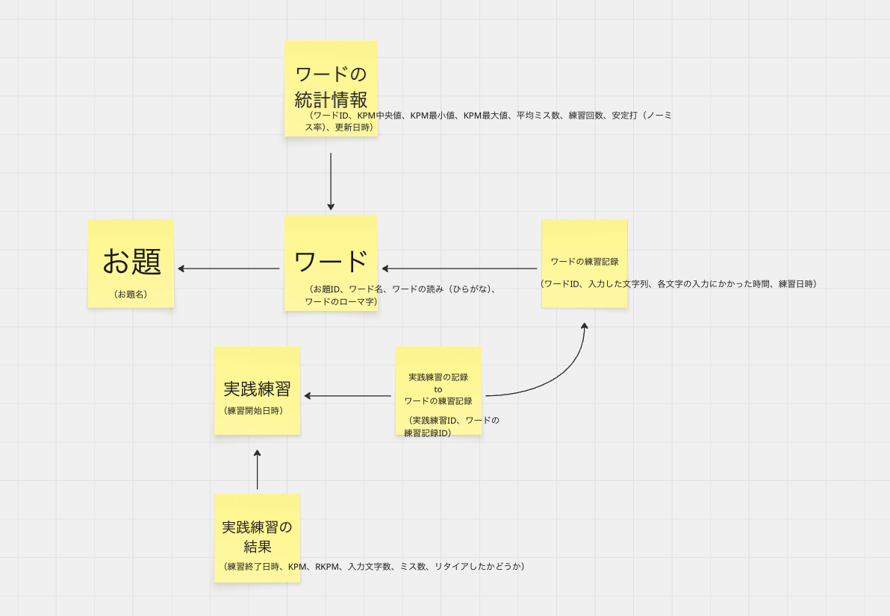

# 設計

## アプリケーションの概要

タイパー向けに、タイピングの基礎練習や反復練習、分析などを行えるアプリケーションを制作する。

## このアプリを作成する目的・動機

e-typingやWeather Typingなどのタイピングゲームでは、ワードがランダムに表示されるため、「ワードをより上手く打つ」という意識で練習することが難しい。そのため、特定のワードを反復練習したり、復習できる仕組みを作りたい。

タイピングの基礎練習のソフトとしては[TypeLighter](https://github.com/physics-HTFI/TypeLighter)があるが、開発が終了してから10数年の時間が経過しているため、新しくモダンな練習ソフトを作りたい。

## ユーザーがアプリケーションを使ってできること

### 練習機能

- ユーザーはe-typingやWeather Typingのワードを練習することができる
- ユーザーはワードの一覧を、上から順番に練習することができる（TypeLighter方式）
- ユーザーはアプリによって計算された適切なタイミングで復習ができる
- ユーザーはワードを特定の条件（ある文字列を含んでいる、KPMが低く苦手など）で絞り込んで練習できる
- ユーザーはe-typingのトライアルのように、問題数や制限時間の決まった実践練習をすることができる

### ログ機能

- ユーザーは特定のワードについて、今までの練習履歴を見ることができる
- ユーザーは特定の実践練習について、その履歴を見ることができる

### 分析機能

- WIP

## 画面イメージ

### お題詳細画面（基礎練習モード）

選択したワードを練習することができる。

入力するとともにグラフがリアルタイムで更新される。グラフには打鍵にかかった時間を文字の下に棒グラフで表示され、その時点でのKPMが折れ線グラフで表示される（画像では折れ線グラフになっている）。

ミスなく入力できると次のワードに進む。最終的にはTypeLighterのように、クリアするために必要なkpmを設定したり、ミス数を設定できるようにする。

ワードをテキストで検索したり、他の条件で検索したり（filter）、並べ替えたり、件数を制限できる。

検索については、以下のMochiのデザインを参考にする（sort、filterの部分）。

### お題詳細画面（実践練習モード）

検索などの仕様は基礎練習モードと共通。

練習を始める前に、終了条件と出題順を設定する。終了条件は問題数または秒数を設定できる。出題順はランダムまたは順番から選択できる。

spaceボタンを押してスタートし、スタートすると基礎練習画面と同様の画面で練習が始まる。

実践練習が終了すると、リザルトが表示される。リザルトにはkpm、入力文字数、ミス数、正解率などが表示される。

### ワード詳細画面

ワードの練習の記録を見ることができる。

画像にはないが、上部にkpmや安定打（ミスなく打った割合）などのサマリを表示する。

実際に入力した文字が確認でき、間違っている部分は赤色で表示される。

グラフで各文字に何秒かかっているか確認することができる。ここは基礎練習モードと同様に、棒グラフにしたい。

### 基礎練習の練習結果画面

（画面イメージは未作成）

基礎練習の記録が一覧表示される画面。

上部には練習のサマリが表示される。平均のKPMや、平均の正確性など。

その下に、練習したワードの一覧が表示される。表示される情報は、ワード、入力した文字列、kpm、日時、など（例: 案外できるものだよ、angaidekirumonodayo、700kpm、2025-06-14 10:53）。

### 実践練習の練習結果一覧画面

実践練習の一覧が確認できる画面。

### 実践練習の練習結果詳細画面

（画面イメージは未作成）

実践練習の詳細が確認できる画面。

上部にはサマリが表示される。kpm、rpkm（初速抜きのkpm）、文字数、ミス数、正確性など。

その下には、各ワードの情報が表示される。ワード、KPM、初速、など。

参考: うあーメモ

### ダッシュボード

WIP

### 統計情報画面

WIP

平均KPM、正確性、打鍵数などの推移を見ることができる。KPMと正確性は折れ線グラフ、打鍵数は棒グラフ。

### 参考画面

[Mochi](https://app.mochi.cards/)と、うあーメモを参考に開発します。

ワードの検索する部分は、以下のMochiのColumn Viewのデザインを参考にします。

## データモデリング

### 画像版

### テキスト版

最低限必要なデータについて記述する。[]の中がモデル（テーブル）名で、その下に箇条書きで属性を記述する。

[お題]

- ID（例: 1）
- お題名（例: 元気が出る言葉）

[ワード]

- ID（例: 1）
- お題ID（例: 1）
- ワード名（例: 案外できるものだよ）
- ワードの読み（例: あんがいできるものだよ）

[ワードの練習記録]

- ID（例: 1）
- ワードID（例: 1）
- 入力した文字列（例: angaidekirumonodayo）
- 各文字の入力に何秒かかったか（例: 0.500, 0.250, 0.300, ...）
- 練習日時（例: 2025-06-14 13:53:52）

[実践練習記録]

- ID（例: 1）
- 練習開始日時（例: 2025-06-14 13:53:50）
- 練習終了日時（例: 2025-06-14 13:54:30）←これを途中でリタイアしたかどうかの判定に使うかも
- KPM（例: 500）
- RKPM=初速抜きのKPM（例: 650）
- 入力文字数
- ミス数

[実践練習記録 to ワードの練習記録]

実践練習記録とワードの練習記録を1:Nで関連づけるための、中間テーブルです。

- ID（例: 1）
- 実践練習ID（例: 1）
- ワードの練習記録ID（例: 1）

---

以下は考え中です。 テーブルとして持つのか、あとから計算するのかなど。

[ワードの統計情報]

- ワードID（例: 1）
- WPM最小値（例: 400）
- WPM最大値（例: 700）
- WPM中央値（例: 500）
- 初速（例: 0.540）
