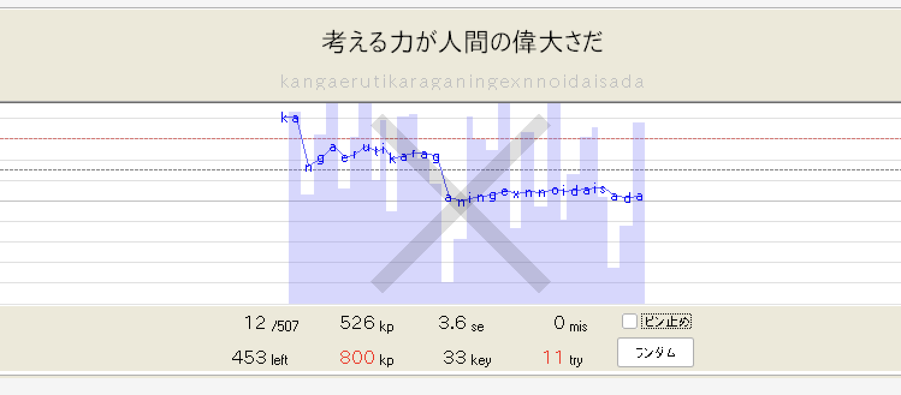
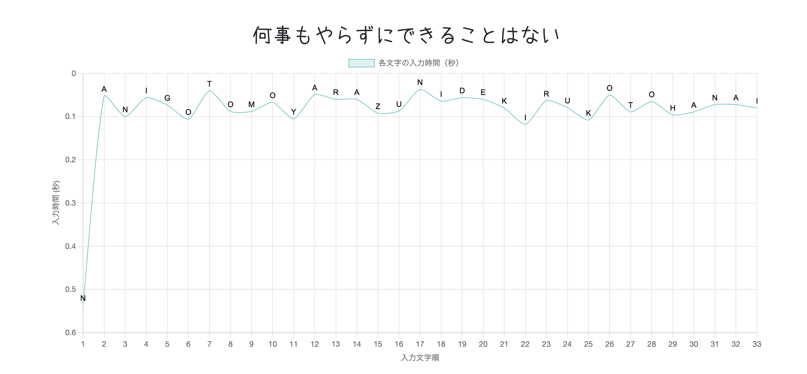
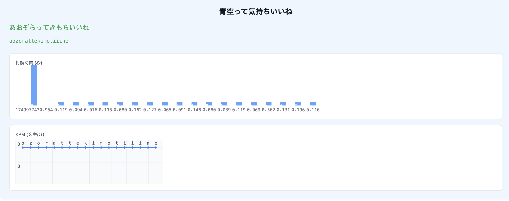
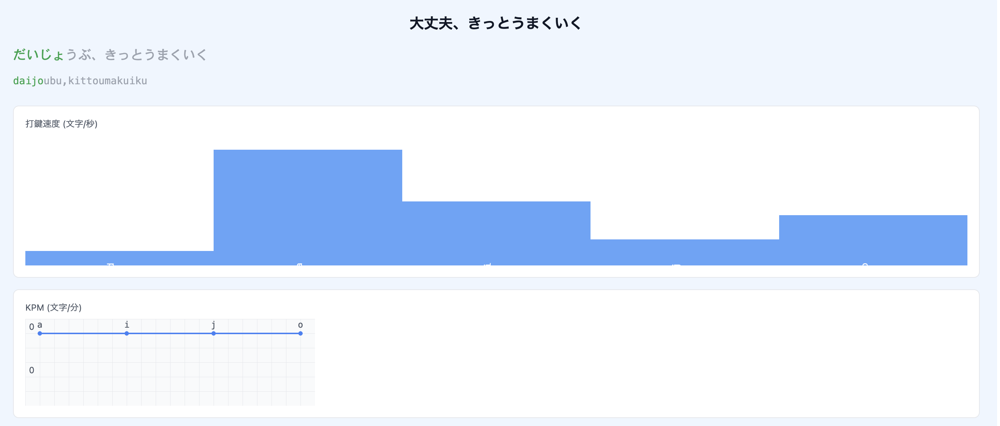
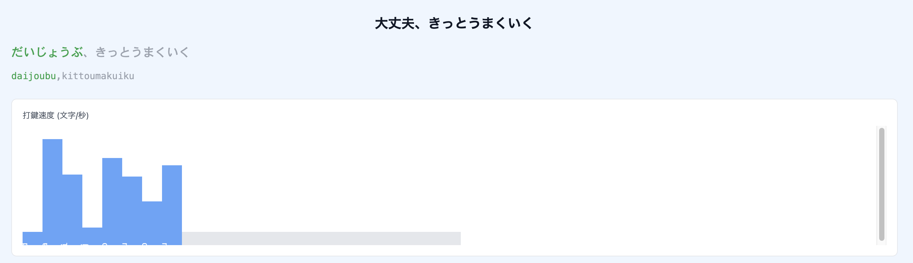
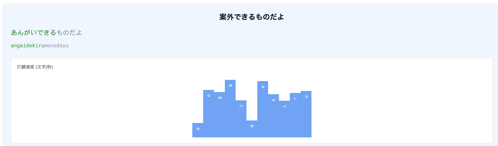

# 機能: リアルタイムの入力グラフ

TypeLightreのように、文字を入力する度に速度の情報をリアルタイムに表示したい。

表示する内容は、

- 打鍵にかかった時間を棒グラフで表示する。うあーメモの折れ線グラフを棒グラフにしたバージョン。
- その時点でのkpmを折れ線グラフで表示する。これはTypeLighterのkpmの折れ線グラフと同じ。

## 参考

### TypeLighter



### うあーメモ



## メモ

グラフに必要な情報。まず、ワードに対応するローマ字の文字列が必要。これは途中で変更されることもある。

それから、各文字にどれくらいかかったかの情報。これを使えば、入力した文字列も復元できるし、kpmも計算できる。

リアルタイムにグラフを更新するから、ステートとして以下のような情報を持っておけばいいかな。

```ts
{
  expectedRoman: "kangaerutikara",
  strokes: [{ key: 'k', time: 500 }, { key: 'a', time: 100 }, { key: 'n', time: 120}]
}
```

## ブラッシュアップ



- 入力秒数の数値は見えずらいので不要です。
- グラフの高さが小さいので、もう少し高くしましょう。
- 棒グラフの棒同士は間隔を空けなくても大丈夫です。
- 縦軸をどう取るかが難しいですね。所要時間をグラフにしたら差が出にくいので、TypeLighterのように逆数を取って速度を表示したほうが遅れたことがわかりやすくていいのかも？いいアイデアがあれば教えてください。



- 棒グラフの棒の幅を固定にしましょう。全ての文字を打ち終わった後にグラフがいっぱいになるように、予測される文字列から幅を計算しましょう。

20~40の間で調整ってどういうことだろう。600pxで10文字なら60pxだけど、それだと幅が広すぎるので40pxにするってことか。これもう固定幅でもいいかもしれないな。



- グラフを中央に配置されるようにしたいです。
- 末入力の部分に対して灰色の棒を表示する必要はありません。
- 文字がめり込んでいて見えない、見える位置に配置しましょう。
- スクロールバーが表示されているのを解消して欲しいです。



- 入力中にグラフの位置が変わっていくので、合計文字数から計算して配置するようにしてください。
- TypeLighterのように、文字の真下に対応する棒が表示されるようにしたいです。ひらがなやローマ字も中央に配置して、フォントの幅または棒グラフの幅を調節してください。
