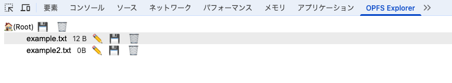
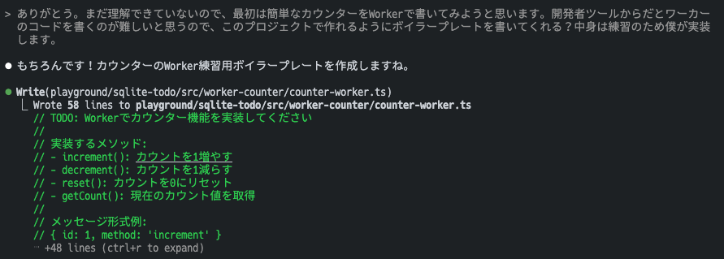

# sqlite-todo

知りたいこと

- [x] OPFSって何？
- [x] OPFSはWorkerからしか使えないの？Workerって何？
- [x] WorkerはpostMessageみたいなAPIで呼び出す必要がある？
- [x] Workerの記述はcomlinkっていうライブラリを使ったら簡潔に書けるの？
- [x] SQLiteのAPIを知りたい。OO APIっていうのかな、一通り使いこなせるようになりたい。
- [x] OPFSの中身を確認するにはどうするのがいい？SQL書いて中身確認したりしたいんだけど。
- [x] データベースアクセスのコードを綺麗に書き直したい！
- [ ] スキーマ管理にsqldefを使いたいんだけど、SQLite Wasmと組み合わせるにはどうすればいい？
- [ ] SQLite Wasmのワーカーを使う場合の初期化方法が2つ書かれている（in the main thread with a wrapped workerっていうやつと、in a worker）けど、これって何が違うの？前者がおすすめされてるみたいだけど。

## OPFSって何？

OPFSはOrigin Private File Systemの略。

Origin = スキーム + ホスト + ポート番号。

ファイルの読み書きが従来のWeb Storageより高速。また、数GB~数十GBのファイルを作ることができ、容量が大きい。

### OPFSの使い方は？

[OPFS（Origin Private File System）についてまとめる](https://zenn.dev/wasuwa/articles/77406ac862a867)

```js
// ルート（FileSystemDirectoryHandle）を取得する
const root = await navigator.storage.getDirectory();

// ディレクトリを作成する
// { create: true }をつければディレクトリを作成できる
const dirHandle = await root.getDirectoryHandle('examples', { create: true })

// ディレクトリを取得する
const dirHandle = await root.getDirectoryHandle('examples')

// ディレクトリを削除する
await root.removeEntry('examples', { recursive: true })
```

```js
// ファイルを作成する
// ディレクトリと同様に、{ create: true }オプションをつけて作成する
const fileHandle = await root.getFileHandle('example.txt', { create: true })

// ファイルに書き込む
// ストリームを取得してから書き込む。非同期らしい。
const writable = await fileHandle.createWritable()
await writable.write("Hello, world")
await writable.close()

// ファイルを読み込む
const file = await fileHandle.getFile()
const content = await file.text()

// Hello, world
console.log(content)
```

```js
// ファイル、ディレクトリの一覧を取得する
// root.entries()で、エントリーの非同期イテレータが取れる
// root.keys()でファイル名飲み、root.values()でハンドルのみ取得できるみたい
for await (const [name, handle] of  root.entries()) {
  console.log(`${name}:${handle.kind}`)
}
```

### OPFS Explorerを使ってみよう

ChromeのDeveloperツールにOPFS Explorerというタブが追加される。中身を編集したりDLできる。



## OPFSはWorkerからしか使えないの？Workerって何？

OPFSには、同期APIと非同期APIがあるらしい。

同期APIの方が高速らしい？なんで？

で、Worker内だと同期APIが使えて、重い処理を逃がせるので、SQLite WasmではWorkerを使うらしい。

workerの使い方は、メインスレッドで

worker.postMessage(data)でデータを送信する
worker.onmessage((event) => { /* 処理 */ })で結果を受け取る

worker側では、

self.onmessage((event) => { /* 処理 */ })

> Workerを利用すると重たい処理を逃すことができるというのは分かったのですが、なぜ非同期APIより同期APIの方が高速なのかがわかりません。

↑とりあえずこの疑問は置いておこう。

## Workerの記述はcomlinkっていうライブラリを使ったら簡潔に書けるの？

comlinkはWorkerとメインスレッド間の通信を普通の関数呼び出しのように書けるライブラリ。~2KBと軽量。

以下のように書けるらしい。Workerを書く感覚がまだないからawaitに違和感がある。

```js
// worker.js
const obj = {
  counter: 0,
  inc() {
    this.counter++;
  },
};

Comlink.expose(obj);

// main.js
const worker = new Worker("worker.js")
const obj = Comlink.wrap(worker)
alert(`Counter ${await obj.counter}`)
await obj.inc()
alert(`Counter ${await obj.counter}`)
```

Claudeと一緒にべんきょう。



```ts
// ワーカーに送信している部分。pendingMessagesはMap。
// promiseを返しているところが肝。
return new Promise((resolve, reject) => {
  this.pendingMessages.set(id, { resolve, reject })

  this.worker!.postMessage({ id, method })
})

// ワーカーの結果が返ってきたときにpromiseを解決することで、イベント駆動を非同期APIに書き換えている(!)
this.worker.onmessage = event => {
  const { id, result, error } = event.data
                                              ```
  const pending = this.pendingMessages.get(id)
  if (pending) {
    this.pendingMessages.delete(id)

    if (error) {
      pending.reject(new Error(error))
    } else {
      pending.resolve(result)
    }
  }
}
```

上記の非同期APIへの書き換え、コールバック→Promiseの場合と同様の考え方らしい。

### ComlinkでTypeScriptの型を使いたい！

Comlinkの`Remote<T>`を使ったり、wrapするときに`wrap<T>`で型を指定してあげたらとりあえず良さそう。ワーカーをrefに入れる時にnullが入り込んでくるのなんとかしたいけど、いい方法は思いつかなかった。

## SQLiteのAPIを知りたい。OO APIっていうのかな、一通り使いこなせるようになりたい。

```js
// select
const result = db.exec('select * from todos where id = 1', {
  returnValue: 'resultRows',
  rowMode: 'object'
})

// create table
db.exec('create table if not exist t(a,b)')

// insert
db.exec({
  sql: 'insert into t(a,b) values(?,?)',
  bind: [1, 2]
})
```

[Object Oriented API #1 (a.k.a. oo1)](https://sqlite.org/wasm/doc/trunk/api-oo1.md)

`exec(sql, optionsObject)`か`exec(optionsObject)`。あんまりわからんかったけどとりあえずexec使っておけば大丈夫か...。

## OPFSの中身を確認するにはどうするのがいい？SQL書いて中身確認したりしたいんだけど。

windowにAPIを生やして、開発者ツールからSQL実行するのが良さそう。→作ってもらいました。神。

```ts
declare global {
  interface Window {
    debugSQL: (sql: string) => Promise<any>
    showTables: () => Promise<any>
    showSchema: (tableName?: string) => Promise<any>
  }
}

// デバッグ関数をwindowに追加
if (typeof window !== 'undefined') {
  window.debugSQL = async (sql: string) => {
    try {
      const result = await dbManager.executeQuery(sql)
      console.table(result)
      return result
    } catch (error) {
      console.error('SQL Error:', error)
      throw error
    }
  }

  window.showTables = async () => {
    return window.debugSQL("SELECT name FROM sqlite_master WHERE type='table'")
  }

  window.showSchema = async (tableName?: string) => {
    if (tableName) {
      return window.debugSQL(`PRAGMA table_info(${tableName})`)
    } else {
      console.log('Usage: showSchema("table_name")')
      return window.showTables()
    }
  }
}
```

## データベースアクセスのコードを綺麗に書き直したい！

今は色々クラスとか作ってもらってるけど、関数でシンプルに書きたい。以下のようなイメージ。

```ts
// todo-api.ts
function getTodos() {
  result = db.exec('SELECT * FROM todos ORDER BY created_at DESC', {
    returnValue: 'resultRows',
    rowMode: 'object',
  })
  return result;
}

const todoApi = {
  getTodos,
}
export type TodoApi = typeof todoApi

Comlink.expose(todoApi)

// App.tsx
function createWorker<T>(path: string): Comlink.wrap<T> {
  return Comlink.wrap<TodoApi>(
    new Worker(
      new URL(path, import.meta.url), {
        type: 'module'
      }
    )
  )
}

const todoApi = useRef(createWorker<TodoApi>('./todo-api.ts'))
const todos = await todoApi.current.getTodos()
```

関数で毎回`initDB`呼び出しているところとか、データベースのアクセスで型アサーション使っている部分とか色々気になるところはあるけれど、なんとなく書き方は分かったのでとりあえずOKとします。

## スキーマ管理にsqldefを使いたいんだけど、SQLite Wasmと組み合わせるにはどうすればいい？

テーブル定義のDDLをちゃんと書けるか自信がない & 宣言的マイグレーションで手を抜きたいので、sqldefやPrismaを使おうかなと思っていました。

## メモ

SQLite + Wasmでわからないところ

データベースのマイグレーションをどうやってやればいいか。

とりあえずデータベース作るならハードコーディングでいいだろうけど、更新したときにどうやって追従するかが問題。migrationsテーブル作って起動したときにやる？とかそんな感じになるのかな。

データベースへのアクセスはどうやるのがいいか。

例えばsqlc（SQLからコードを生成するライブラリ）のTypeScript用のものがあって、better-sqlite3のコードを吐くらしいが、これはsqlite-wasmで使えるのか。

[sqlc-dev/sqlc-gen-typescript](https://github.com/sqlc-dev/sqlc-gen-typescript)

Prismaは多分使えないと思う。

前SQLのスキーマからコード生成するライブラリ（Prismaみたいなやつ）を作ろうとしたことがあって、これの開発を進めるのもいいかも？

[tekihei2317/fuwa-orm: Lightweight ORM for SQLite which works anywhere (WIP).](https://github.com/tekihei2317/fuwa-orm)
